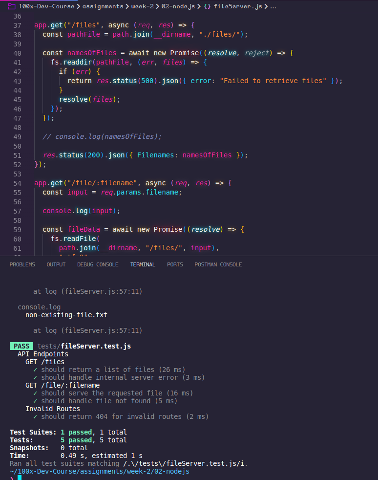
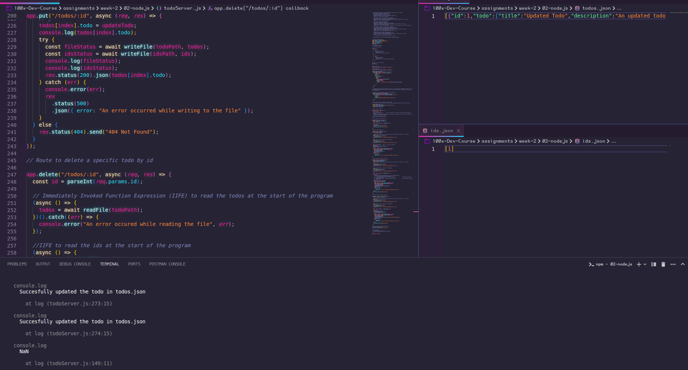
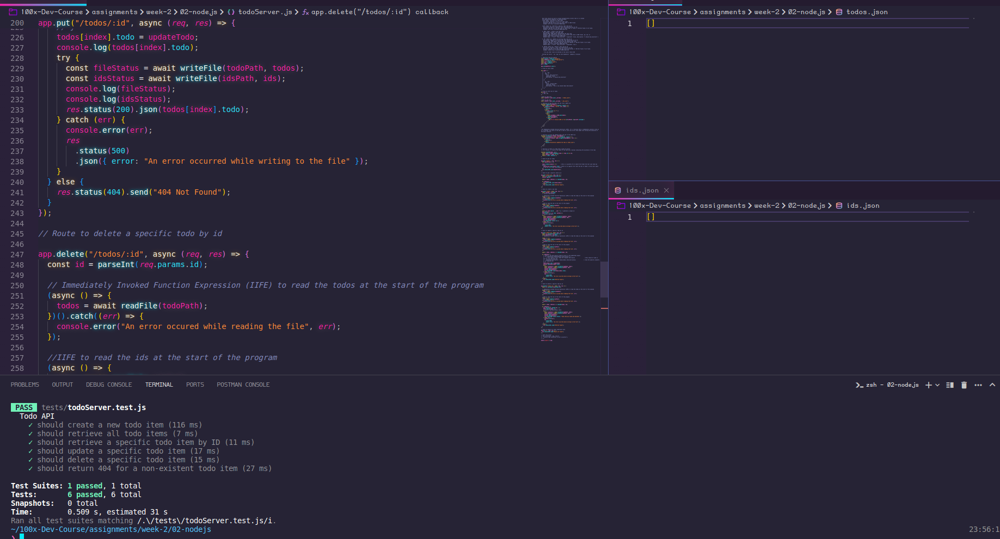
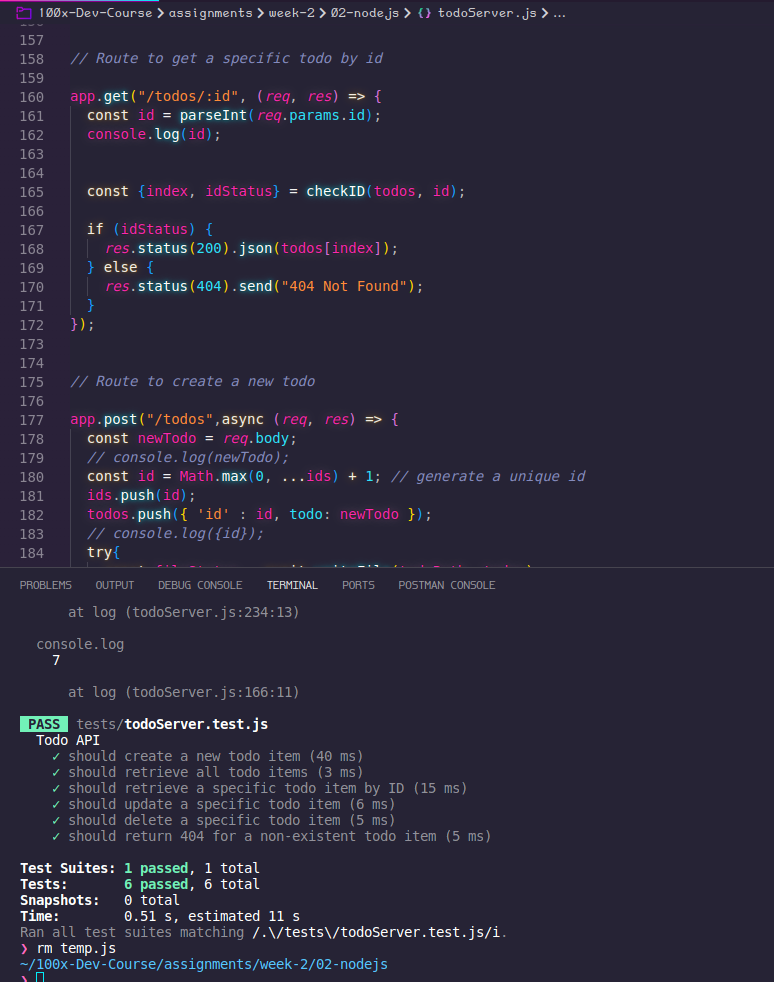

# Node.js Assignments

In this series of assignments, you are going to create native HTTP servers in Node.js which will handle different kinds of application logics.

You are provided empty JavaScript files (or having function signatures) in this directory. You have to follow the instructions given in each file and then run automated tests (also mentioned in each file) to check if you have successfully completed the assignment or you still have few more things to learn in it 😜

#### Assignments
Recommended order of attempting the assignments.
1. Todo List App
2. File Server

#### Important Notes
1. If you are unable to understand the request/response of any assignment file or whatever the way it is being tested, you can take a look at its respective test file present in `tests/` directory.
2. Don't try to make any changes to the test files present in the `tests/` directory.
3. Don't make any changes to the code already present in files including function/method/class signatures and module exports.
4. To run individual tests - 
 - npm run test-fileServer
 - npm run test-todoServer

#### Development Setup
1. Install the dependencies used by running `npm install` command in your terminal.
2. We used `18.x.y` Node.js version, if anything doesn't work then please consider upgrading your node installation.

 

# Solutions

### 1. File Server API Solution Documentation

#### Pictures

This is a simple Express HTTP server in Node.js that handles the logic of a file server. It uses the built-in Node.js fs module to interact with the file system.

API Endpoints
1. GET /files
This endpoint returns a list of files present in the ./files/ directory.

Response: 200 OK with an array of file names in JSON format.

Example: GET http://localhost:3000/files

2. GET /file/:filename
This endpoint returns the content of a given file by name. It uses the filename from the request path parameter to read the file from the ./files/ directory.

Response: 200 OK with the file content as the response body if found, or 404 Not Found if not found. Returns File not found as text if file is not found.

Example: GET http://localhost:3000/file/example.txt

For any other route not defined in the server, it returns a 404 status code with the message "Route not found".

Testing the Server
To test the server, run the npm run test-fileServer command in the terminal.

Code Overview
The server is created using the Express framework. It uses the fs module to read the directory and file contents. The path module is used to join paths in a platform-independent way.

The server defines two routes:

GET /files: This route uses fs.readdir to read the directory and return the list of files.
GET /file/:filename: This route uses fs.readFile to read the content of a specific file. The filename is taken from the request parameters.
If a request is made to a route that is not defined, the server responds with a 404 status code and a message "Route not found".

The server is exported as a module, which allows it to be imported and used in other files.

### 2. Todo List Solution Documentation

####  Pictures

    
    

    

This Node.js application uses the Express.js framework to create a simple HTTP server for a todo list application. The data is stored in-memory in an array and also persisted in a file for durability. The application uses the following Node.js modules:

express: This is a web application framework for Node.js. It simplifies the process of writing server code.
body-parser: This is a middleware that parses incoming request bodies before your handlers and is available under the req.body property.
fs: This is a built-in Node.js module for file system operations. It's used here to read and write data to files.
path: This is a built-in Node.js module for handling and transforming file paths.
The application defines the following HTTP endpoints:

GET /todos: This endpoint retrieves all todo items. It reads the todos from the array and sends them back in the response.

GET /todos/:id: This endpoint retrieves a specific todo item by its ID. It finds the todo in the array and sends it back in the response.

POST /todos: This endpoint creates a new todo item. It generates a unique ID for the new todo, adds it to the array, and writes the updated array to the file.

PUT /todos/:id: This endpoint updates an existing todo item by its ID. It finds the todo in the array, updates its data, and writes the updated array to the file.

DELETE /todos/:id: This endpoint deletes a specific todo item by its ID. It finds the todo in the array, removes it, and writes the updated array to the file.

The application uses Immediately Invoked Function Expressions (IIFEs) to read the todos and IDs from the file when the application starts. This is done to ensure that the data in memory is synchronized with the data in the file.

The application also uses the checkID function to check if a todo with a given ID exists in the array. This function is used in the GET /todos/:id, PUT /todos/:id, and DELETE /todos/:id endpoints.

The application uses the writeFile function to write the updated todos and IDs to the file. This function is used in the POST /todos, PUT /todos/:id, and DELETE /todos/:id endpoints.

The application uses the readFile function to read the todos and IDs from the file. This function is used in the IIFEs and in the POST /todos, PUT /todos/:id, and DELETE /todos/:id endpoints.

The application uses the app.all("*", ...) route to handle all other undefined routes. If a client sends a request to an undefined route, the server will respond with a 404 status code and a "Route not found" message.

Finally, the application exports the app object for testing purposes.

 4 min read 

